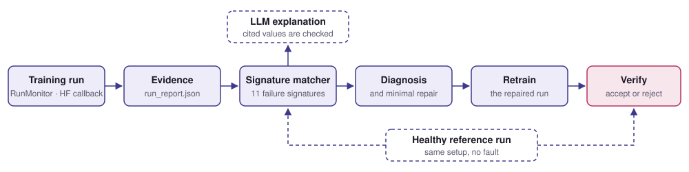

# RunSleuth: Evidence-grounded ML Training Failure Diagnosis and Repair Verification

[](https://github.com/Kaiden118/RunSleuth-Evidence-Grounded-ML-Training-Failure-Diagnosis-and-Repair-Verification/actions/workflows/ci.yml)


[](LICENSE)

RunSleuth finds silent bugs in PyTorch training runs, the kind that never crash and
barely move accuracy, and accepts a fix only after retraining verifies it.



## Example

A ResNet18 on Camelyon17 pathology patches whose classification head was frozen by
mistake. Its validation accuracy, 98.2%, is above the healthy run's 97.9%.

```bash
runsleuth diagnose --run examples/frozen_head/run_report.json --reference examples/clean/run_report.json --no-llm
```

```text
Diagnosis: frozen_head  (decided by signature_matcher)
Evidence:
  + head_max_trainable_fraction = 0.0 (== 0)
  + head_max_gradient_fraction = 0.0 (== 0)
  + head_max_update_norm = 0.0 (== 0)
  + backbone_min_update_norm = 0.03682979467213154 (> 0)
  + reference_head_min_trainable_fraction = 1.0 (== 1)
Repair: Set requires_grad=True on the head; the optimizer already contains its tensors.
```

Its metrics pass every check against the healthy run, and verification still rejects it:

```bash
runsleuth verify --candidate examples/frozen_head/run_report.json --reference examples/clean/run_report.json
```

```text
Decision: rejected
Re-diagnosis: frozen_head
No regression against the reference:
  + id accuracy_drop = -0.003 (<= 0.01)
  + id loss_ratio = 0.8849 (<= 1.1)
  + ood accuracy_drop = 0.005 (<= 0.01)
  + ood loss_ratio = 0.8586 (<= 1.1)
Reason: re-diagnosis against the reference found frozen_head
```

## Install

```bash
git clone https://github.com/Kaiden118/RunSleuth-Evidence-Grounded-ML-Training-Failure-Diagnosis-and-Repair-Verification.git
cd RunSleuth-Evidence-Grounded-ML-Training-Failure-Diagnosis-and-Repair-Verification
pip install torch==2.13.0 torchvision==0.28.0 --index-url https://download.pytorch.org/whl/cu130
pip install -e ".[dev,llm,hf,camelyon]"
```

Python 3.11. Diagnosis runs on CPU; training needs an NVIDIA GPU with 8 GB. Or use
Docker: `docker build --target runtime -t runsleuth .`

## Usage

```python
from runsleuth.run_monitor import RunMonitor

monitor = RunMonitor(model, optimizer, "runs/my-run", head="fc")
for epoch in range(epochs):
    with monitor.epoch():
        ...  # your training loop, unchanged
    monitor.log(id_validation_accuracy=accuracy, id_validation_loss=loss)
monitor.close()
```

With the Hugging Face `Trainer`, add
`callbacks=[RunSleuthCallback("runs/my-run", head="classifier")]` from
`runsleuth.hf_callback`. Then diagnose, repair, retrain and verify:

```bash
runsleuth diagnose --run runs/my-run/run_report.json --reference runs/healthy/run_report.json
runsleuth verify --candidate runs/my-run-fixed/run_report.json --reference runs/healthy/run_report.json
```

For an LLM explanation, set `GEMINI_API_KEY` and `GEMINI_MODEL`, or pass
`--provider ollama` for a local model. It must cite the evidence and cannot change the
diagnosis. `--no-llm` skips it.

## What It Detects

| Fault | Decisive evidence |
|---|---|
| Stale optimizer binding | The new head gets gradients but never updates |
| Frozen classifier head\* | The head is untrainable; the reference trains it |
| Learning rate far too high | Rate inferred from AdamW's first update |
| Missing `optimizer.step()` | Gradients exist, no parameter changes |
| Train/eval normalization mismatch | Training and evaluation inputs differ |
| Head larger than the label set | 1000 outputs for 2 classes |
| Partly frozen backbone\* | Some backbone tensors never get gradients |
| Training in eval mode\* | Steps train on eval-mode forwards |
| Per-epoch schedule stepped every batch\* | The rate falls and rises within an epoch |
| Training on a held-out group† | Training data from a held-out hospital, patient or lesion |
| An epoch at zero learning rate† | The rate is zero for a whole epoch |

\*Confirmed only with a healthy reference run; without one RunSleuth waits instead of
guessing. †New, checked on one development seed, not part of the results below.

## Results

Camelyon17-WILDS, ResNet18 and DeiT-small (Hugging Face), nine injected faults. Held-out
seeds were drawn at random after signatures, prompt and thresholds were frozen.

| | Development | Held-out |
|---|---:|---:|
| Correct diagnosis, given a healthy reference | 56/56 | 42/42 |
| Without a reference: correct · deferred · wrong | 46 · 10 · 0 | 34 · 8 · 0 |
| False positives on healthy runs | 0/32 | 0/24 |
| Repairs accepted after retraining | 18/18 | 19/20 |

- 11 of 38 faulty runs stayed within the thresholds of their healthy counterparts:
  validation metrics alone would have passed them.
- LLM explanations agreed with the matcher in 63/64 held-out cases (Gemini 3.5
  Flash-Lite) and in all 52 valid replies of a local Qwen3-8B.

Numbers come from the JSON [records](evaluations/results). Faults were injected by the
author and thresholds are development choices; this is not a statistical benchmark.

## Roadmap

| Task                                                 | Status |
| ---------------------------------------------------- | :----: |
| Training monitor, first fault on Camelyon17          |    ☑   |
| Nine faults, signature library, ResNet18 and DeiT    |    ☑   |
| Repair verification, held-out seeds, LLM explanation |    ☑   |
| Command line, CI, Docker                             |    ☑   |
| Repair tasks and harness for LLM agents              |    ☑   |
| LLM agent that repairs training code, pilot study    |    ☐   |
| Main agent experiments and baselines                 |    ☐   |
| Second dataset (HAM10000)                            |    ☐   |
| Report and release                                   |    ☐   |


The agent work measures how often an LLM agent declares a silent fault repaired when it is not. Its tasks are ready: `python -m runsleuth.agent_tasks list`.

## Reproduce

Set `data_dir` in [`configs/camelyon17_clean.json`](configs/camelyon17_clean.json);
the download is about 20 GB. Names in angle brackets are run directories that earlier
commands print.

```bash
python -m runsleuth.camelyon --download --prepare-only
python -m runsleuth.camelyon
python -m runsleuth.camelyon_optimizer_sweep --reference-run <baseline-run> --execute
python -m runsleuth.camelyon_frozen_head_training --reference-run <seed-baseline-run>
python -m runsleuth.camelyon_config_faults --reference-run <seed-baseline-run>
python -c "from transformers import AutoModelForImageClassification as M; M.from_pretrained('facebook/deit-small-patch16-224')"
python -m runsleuth.camelyon_vit --reference-run <seed-baseline-run>
python -m runsleuth.camelyon_loop_faults --reference-run <seed-baseline-run>
python -m runsleuth.heldout draw --count 2
python -m runsleuth.heldout run --reference-run <baseline-run>
```

## Tests

```bash
python -m pytest
```

Tiny models and synthetic data, no GPU. [GitHub Actions](.github/workflows/ci.yml)
runs them on every push and repeats them inside the [Docker image](Dockerfile).

## License

[MIT](LICENSE). Datasets and pretrained weights keep their own licenses.
