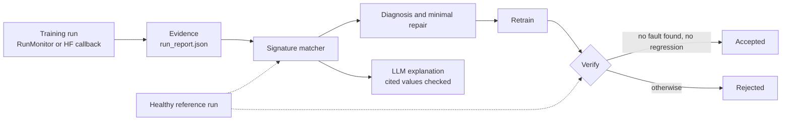

# RunSleuth

**Find silent bugs in PyTorch training runs, and check that a fix is real.**

[](https://github.com/Kaiden118/RunSleuth-Evidence-Grounded-ML-Training-Failure-Diagnosis-and-Repair-Verification/actions/workflows/ci.yml)


[](LICENSE)

Some training bugs never crash and barely move accuracy: an optimizer that still holds
a replaced head, a layer left frozen, a schedule stepped at the wrong time, validation
data that leaked into training. RunSleuth records what the metrics cannot show
(gradients, parameter updates, optimizer membership, train/eval mode, learning rates,
input statistics, data splits), matches it against a library of failure signatures, and
accepts a repair only after the retrained run has been checked against a healthy one.

## A bug that the metrics do not show

The repository ships three run reports of a ResNet18 trained on Camelyon17 pathology
patches. In one of them the classification head was frozen by mistake. Its validation
accuracy is 98.2%; the healthy run reaches 97.9%. (The outputs below omit their closing
lines, which list the other signatures and the path of the saved report.)

```bash
runsleuth diagnose --run examples/frozen_head/run_report.json --reference examples/clean/run_report.json --no-llm
```

```text
Diagnosis: frozen_head  (decided by signature_matcher)
Evidence:
  + head_max_trainable_fraction = 0.0 (== 0)
  + head_max_gradient_fraction = 0.0 (== 0)
  + head_max_update_norm = 0.0 (== 0)
  + backbone_min_update_norm = 0.03682979467213154 (> 0)
  + reference_head_min_trainable_fraction = 1.0 (== 1)
Repair: Set requires_grad=True on the head; the optimizer already contains its tensors.
```

Verification shows why metrics are not enough. Checked against the healthy run, the
faulty run passes every metric test and is still rejected, because the fault is still
there:

```bash
runsleuth verify --candidate examples/frozen_head/run_report.json --reference examples/clean/run_report.json
```

```text
Decision: rejected
Re-diagnosis: frozen_head
No regression against the reference:
  + id accuracy_drop = -0.003 (<= 0.01)
  + id loss_ratio = 0.8849 (<= 1.1)
  + ood accuracy_drop = 0.005 (<= 0.01)
  + ood loss_ratio = 0.8586 (<= 1.1)
Reason: re-diagnosis against the reference found frozen_head
```

The repaired run in `examples/frozen_head_repaired` is accepted by the same command.

## Installation

Python 3.11. Diagnosis and verification run on CPU; the experiments need an NVIDIA GPU
with 8 GB.

```bash
git clone https://github.com/Kaiden118/RunSleuth-Evidence-Grounded-ML-Training-Failure-Diagnosis-and-Repair-Verification.git
cd RunSleuth-Evidence-Grounded-ML-Training-Failure-Diagnosis-and-Repair-Verification
pip install torch==2.13.0 torchvision==0.28.0 --index-url https://download.pytorch.org/whl/cu130
pip install -e ".[dev,llm,hf,camelyon]"
```

Choose the PyTorch index for your CUDA version on
[pytorch.org](https://pytorch.org/get-started/locally/). On Windows, keep the clone path
under about 120 characters or enable long paths.

To try the examples without installing anything else, use Docker (in Windows CMD,
write `%cd%` for `$(pwd)`):

```bash
docker build --target runtime -t runsleuth .
docker run --rm -v "$(pwd)/examples:/work/examples:ro" runsleuth diagnose --run examples/frozen_head/run_report.json --reference examples/clean/run_report.json --no-llm
```

## Use it on your own training

**1. Monitor.** Wrap each epoch of your loop; nothing else changes.

```python
from runsleuth.run_monitor import RunMonitor

monitor = RunMonitor(model, optimizer, "runs/my-run", head="fc")
for epoch in range(epochs):
    with monitor.epoch():
        ...  # your training loop
    monitor.log(id_validation_accuracy=accuracy, id_validation_loss=loss)
monitor.close()
```

With the Hugging Face `Trainer`, pass
`callbacks=[RunSleuthCallback("runs/my-run", head="classifier")]` from
`runsleuth.hf_callback` instead.

**2. Diagnose.** A healthy run of the same setup is optional; with one, RunSleuth can
also confirm faults that depend on what you intended, such as a frozen layer.

```bash
runsleuth diagnose --run runs/my-run/run_report.json --reference runs/healthy/run_report.json
```

**3. Repair, retrain, verify.** `verify` exits with status 1 when it rejects the repair,
so a script or a CI job can stop on it.

```bash
runsleuth verify --candidate runs/my-run-fixed/run_report.json --reference runs/healthy/run_report.json
```

For an explanation in plain language, set `GEMINI_API_KEY` and `GEMINI_MODEL`, or pass
`--provider ollama` with `OLLAMA_MODEL` set to use a local model. The explanation must
cite the evidence, every cited value is checked, and it cannot change the diagnosis.
`--no-llm` skips it.

## What it detects

| Fault | What the evidence shows | Needs a healthy reference |
|---|---|:---:|
| Stale optimizer binding | The new head gets gradients but is not in the optimizer and never updates | no |
| Frozen classifier head | The head is untrainable, while the reference trains it | yes |
| Learning rate far too high | The rate inferred from AdamW's first update is outside the fine-tuning range | no |
| Missing `optimizer.step()` | Forwards and gradients, yet no parameter changes | no |
| Train/eval normalization mismatch | Training and evaluation inputs have different statistics | no |
| Head larger than the label set | More head outputs than label classes, such as 1000 for 2 | no |
| Partly frozen backbone | Some backbone tensors never receive gradients; the reference trains them | yes |
| Training in eval mode | Optimizer steps train on eval-mode forwards; BatchNorm statistics stay frozen | yes |
| Per-epoch schedule stepped every batch | The rate falls and rises again within an epoch | yes |
| Training on a held-out group† | Training samples come from a hospital, patient or lesion that an evaluation split holds out | no |
| An epoch at zero learning rate† | The rate is zero at every step of an epoch | no |

Signatures are declarative: each lists the evidence it requires and the evidence that
contradicts it, in [`failure_signatures.json`](src/runsleuth/failure_signatures.json).
A fault that only a reference can confirm waits for one instead of guessing.
†Added for the agent study below and checked on one development seed so far; not part
of the results that follow.

## How it works



Verification has two parts, and neither is enough alone. The **mechanism check**
re-diagnoses the retrained run: a fault that is silent in the metrics passes any metric
comparison, so only this check can refuse it. The **reference comparison** requires no
regression against the healthy run: a correct repair can lower a metric, as removing a
data leak does, so comparing with the faulty run would refuse it.

## Results

Camelyon17-WILDS with ResNet18 and DeiT-small and nine injected faults. Each fault ran
on two development seeds and on two or more held-out seeds, which were drawn at random
after the signatures, the LLM prompt and the verification thresholds were frozen.

| | Development | Held-out |
|---|---:|---:|
| Runs diagnosed correctly, given a healthy reference | 56/56 | 42/42 |
| Without a reference: correct · deferred to a reference · wrong | 46 · 10 · 0 | 34 · 8 · 0 |
| False positives on healthy runs | 0/32 | 0/24 |
| Repairs accepted after retraining | 18/18 | 19/20 |

- **11 of 38 faulty runs** stayed within the verification thresholds of their healthy
  counterparts, so validation metrics alone would have passed them.
- **LLM explanations** of the held-out diagnoses agreed with the matcher in 63 of 64
  cases with Gemini 3.5 Flash-Lite, and in all 52 valid replies of a local Qwen3-8B.
  The matcher stays final either way.

<details>
<summary>Per-fault results and notes</summary>

Cells read development · held-out.

| Fault | Within the healthy run's thresholds | Repair accepted |
|---|---:|---:|
| Stale optimizer binding | 1/2 · 3/4 | 2/2 · 4/4 |
| Frozen classifier head | 1/2 · 2/2 | 2/2 · 2/2 |
| Learning rate 100x too high | 0/2 · 0/2 | 2/2 · 2/2 |
| Missing `optimizer.step()` | 0/2 · 0/2 | 2/2 · 2/2 |
| Train/eval normalization mismatch | 0/2 · 0/2 | 2/2 · 1/2 |
| ImageNet head kept for 2 labels | 1/2 · 0/2 | 2/2 · 2/2 |
| Frozen patch embedding (DeiT) | 2/2 · 1/2 | 2/2 · 2/2 |
| Training in eval mode | 0/2 · 0/2 | 2/2 · 2/2 |
| Per-epoch schedule stepped every batch | 0/2 · 0/2 | 2/2 · 2/2 |

- The one rejected repair evaluates with the DeiT processor's 0.5 normalization, which
  trained worse on that seed; across four seeds neither normalization is consistently
  better.
- The verification rule was revised once, after the development runs; the held-out
  seeds used it unchanged.
- Qwen3-8B returned a valid reply at the first try in 51 of 64 reviews. The failures
  came from constrained decoding cutting Python's `e-05` exponents, since fixed.

</details>

Every number comes from the JSON [records](evaluations/results). The faults were
injected by the author and the thresholds are development thresholds, so this is not a
statistical benchmark.

## RunSleuth for LLM agents (in progress)

LLM agents now write and debug training code, and they judge a fix by whether a metric
went up. The current work measures how often an agent declares a silent fault repaired
when it is not, and what evidence and verification change. What exists so far:

- **Repair tasks.** One training script with a fault written into its source: nine
  faults, including a validation hospital used for training and a schedule that fails
  only in its last epoch, plus the healthy script and two correct scripts that only
  look faulty.
- **A harness** that owns the data, the budget, the monitoring and the evaluation, so
  an agent cannot edit its own scorer. Scripts are checked statically and run in a
  subprocess with a time limit and no credentials. This is a guard, not a sandbox.
- **A bounded replay check** that compares hashed model states with the healthy run's,
  over a full run or over a run stopped early.

```bash
python -m runsleuth.agent_tasks list
python -m runsleuth.agent_tasks show validation_hospital_in_training
python -m runsleuth.agent_workspace check --output artifacts/agent_tasks/check-1 --data camelyon --config configs/camelyon17_clean.json --epochs 2 --max-train-batches 200
```

The last command trains every task for the same short budget and diagnoses each run
against the healthy one. The agent itself and its experiments come next.

## Reproducing the experiments

<details>
<summary>Commands</summary>

Set `data_dir` in [`configs/camelyon17_clean.json`](configs/camelyon17_clean.json).
The download is about 20 GB. Replace the names in angle brackets with the run
directories that the earlier commands print.

```bash
python -m runsleuth.camelyon --download --prepare-only
python -m runsleuth.camelyon
python -m runsleuth.camelyon_optimizer_sweep --reference-run <baseline-run> --execute
python -c "from transformers import AutoModelForImageClassification as M; M.from_pretrained('facebook/deit-small-patch16-224')"
python -m runsleuth.camelyon_frozen_head_training --reference-run <seed-baseline-run>
python -m runsleuth.camelyon_config_faults --reference-run <seed-baseline-run>
python -m runsleuth.camelyon_vit --reference-run <seed-baseline-run>
python -m runsleuth.camelyon_loop_faults --reference-run <seed-baseline-run>
python -m runsleuth.signature_matching evaluate <experiment-report.json> ...
python -m runsleuth.heldout draw --count 2
python -m runsleuth.heldout run --reference-run <baseline-run>
python -m runsleuth.llm_review_eval run --provider ollama --model qwen3:8b --from-record <signature-matching-record>
```

The sweep creates the development baselines for seeds 7 and 2026. `heldout draw`
records new seeds with the commit and the hashes of everything frozen, and
`heldout run` trains and scores them, resuming after an interruption. A guided demo
injects a hidden fault, diagnoses it, repairs it and verifies the repair:

```bash
runsleuth demo --baseline <baseline-run> --fault clean --no-llm
runsleuth demo --baseline <baseline-run> --reference <demo-run>/faulty/run_report.json --fault random --blind
```

</details>

## Limitations

- The faults are injected, on one dataset and two architectures. None is a reproduction
  of a real incident yet.
- The verification thresholds (accuracy within 0.01, loss within 10% of the healthy
  run) are development choices, not statistical guarantees.
- The signature library is finite: a run with no known fault is not a run with no
  fault.
- The data is read from a pinned community mirror of Camelyon17-WILDS; split sizes,
  hospitals and labels match the official release, but image-level identity with it
  has not been verified.
- Nothing here supports a clinical claim.

## Related work

[TrainCheck](https://arxiv.org/abs/2506.14813) infers invariants from healthy runs to
detect silent training errors, and [TTrace](https://arxiv.org/abs/2506.09280) compares
tensors with a trusted reference implementation.
[AutoTrainer](https://2021.icse-conferences.org/details/icse-2021-papers/81/AUTOTRAINER-An-Automatic-DNN-Training-Problem-Detection-and-Repair-System)
and [DeepDiagnosis](https://arxiv.org/abs/2112.04036) detect and repair training
problems that show symptoms. For agents,
[ReX-MLE](https://arxiv.org/abs/2512.17838) benchmarks them on medical-imaging
challenges and
[RewardHackingAgents](https://arxiv.org/abs/2603.11337) measures whether they keep
their own evaluation intact. RunSleuth's part is the step after detection: naming the
fault, and verifying a repair against a healthy run instead of the faulty one.

## Development

```bash
python -m pytest
```

The tests use tiny models and synthetic data and need no GPU.
[GitHub Actions](.github/workflows/ci.yml) lints and runs them on every push, then
builds the [Docker image](Dockerfile), runs the tests inside it, and diagnoses and
verifies the example runs there.

## License

[MIT](LICENSE). Datasets and pretrained weights keep their own licenses.
